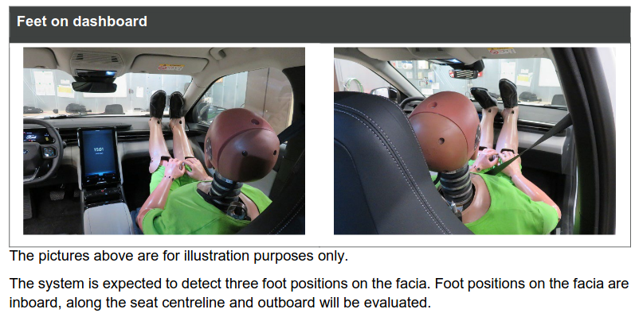
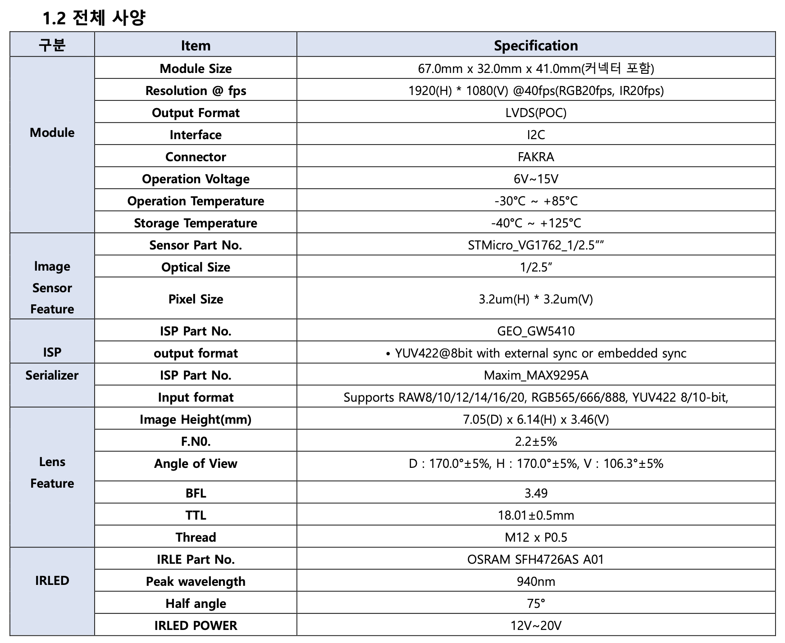

# Out of Position - Feet on Dashboard assignment

## Introduction

Euro NCAP is a vehicle safety rating system, which defines a list of protocols to evaluate the safety of new cars through crash tests and other safety assessments. One of the assessment is Out-of-Position detection, in which we assess if the system is capable of recognizing if the driver/front passenger’s body posture is falling into either 1 and/or 2 cases as below:

### Case 1: The front passenger puts 1 or 2 feet(s) on the dashboard



### Case 2: The driver/front passenger is leaning forward and in close proximity to the facia, independent of the position of the front seat:


For this assignment, we will only focus on **OOP Case 1 - Feet on Dashboard**

## Task description

Along with this file, we provided you a video named `sample_output.mp4` and a folder named `input`, with the structure is as below:

```
|--- sample_output.mp4
|--- input  
      |---profile1
            |---positive_1.mp4
            |---positive_2.mp4
            |---negative_1.mp4
            |---negative_2.mp4
      |---profile2
            |---positive_1.mp4
            |---positive_2.mp4
            |---negative_1.mp4
            |---negative_2.mp4
      |---profile3
            |---positive_1.mp4
            |---negative_1.mp4   
```


Every video in one directory profile[] has the exact same front passenger, furthermore:

On every video named `negative_[].mp4` , the front passenger has the normal feet posture in every frame

On every video named `positive_[].mp4`, the front passenger has the “out-of-position” feet posture in some or every frames (OOP Case 1 - Feet on Dashboard)

Every video was recorded using the same camera (please refer to the below section for more detail) + same in-cabin car model (Hyundai Santafe)

This assignment requires developing an algorithm to detect in **each frame** of **each video** whether the front passenger puts their feet/foot on the dashboard area (POSITIVE) or not (NEGATIVE), as shown in the `sample_output.mp4` (this is an **example output video** and does not guarantee to be the ground truth)

## Supplemental Material

If your solution uses camera intrinsic parameters/specifications, please refer to this information:


- cx: 924.65430795264774
 
- cy: 580.41919770485049

- fx: 595.8036047830891

- fy: 598.33827405037948

- distortion: [-0.015349419086740696, -0.0536764772521049, 0.061315407683887907, -0.026142516909791854]


 
## Requirement

To ensure a fair recruitment process, please adhere to the following requirements for your submissions:

### 1. Submission Format: 
The submission format we expect from you is as below:

```
submission
|--- input                      # Directory contains input videos
      |---...
|---output                      # Directory contains output videos
      |---profile1
            |---positive_1.mp4  # Output video for input/profile_1/positive_1.mp4
            |---positive_2.mp4  # Output video for input/profile_1/positive_2.mp4
            |---negative_1.mp4  # Output video for input/profile_1/negative_1.mp4
            |---negative_2.mp4  # Output video for input/profile_1/negative_2.mp4
      |---profile2
            |---positive_1.mp4  # Output video for input/profile_2/positive_1.mp4
            |---positive_2.mp4  # Output video for input/profile_2/positive_1.mp4
            |---negative_1.mp4  # Output video for input/profile_2/negative_1.mp4
            |---negative_2.mp4  # Output video for input/profile_1/negative_2.mp4
      |---profile3
            |---positive_1.mp4  # Output video for input/profile_3/positive_1.mp4
            |---negative_1.mp4  # Output video for input/profile_3/negative_1.mp4
|---README.pdf/md               # Report file
|---solution                    # Solution repo (code, model, etc. should be put into this repo)
```

### 2. Solution Requirement: 

You may use any approach, including:

- Deep learning–based methods
- Rule-based methods
- Hybrid solutions

Preferred programming languages:

- C/C++ (highly preferred)
- Python

*(Other languages may be considered but are not recommended)*

### 3. Reproducibility: 

Your solution must be fully reproducible, which means we should be able to:

- Run your submitted code

- Follow your instructions

- Generate the exact same output videos you provide

Therefore, please make sure to include:

- Clear setup instructions

- Dependency/version information

- Scripts or commands required to run the solution

- Any pretrained models or download instructions

### 4. Generalization:

We do not expect a “perfect” solution (100% accuracy on every frame/every video), therefore please avoid using video-specific or heavily customized configurations designed only to optimize results for individual videos, as we prioritize a solution that:
- Generalizes well across different videos and scenarios
- Uses a consistent and scalable approach
- Maintains reasonable robustness without excessive manual tuning

### 5. Code Quality:

We place strong emphasis on code quality, therefore your submission repository should be:
- Clean and well organized
- Easy to understand and execute
- Properly documented

Please ensure:

- Readable and maintainable code
- Meaningful naming conventions
- Appropriate comments where necessary
- Clear project structure

### 6. Documentation and Report:

Please provide a report describing:

- Your overall approach and methodology
- System architecture or processing pipeline
- How to run the solution and reproduce the outputs
- Key assumptions, observations, and limitations
- References or supporting materials (if applicable)

Accepted formats include:

- PDF

- Markdown (.md)

- Jupyter Notebook

- Other equivalent formats, but please avoid Office format (.doc/.docx, etc.) as they might have compatibility issues on different platforms

If possible, also include:

- Suggestions for future improvements

- Ideas you would explore with additional time/resources

### 7. Confidentiality:

To ensure a fair recruitment process and avoid legal/privacy issues:

- Do not share the assignment publicly

- Do not distribute any provided data or materials, as they might contain personal identifiable information

- Keep your repository private if using version control

### 8. Questions and Support:

If you have any questions regarding the assignment, please contact us before the designated deadline. Deadline extensions may be considered depending on the situation.

## Copyright

All rights reserved by DeltaX, 2026.

## Good Luck!


